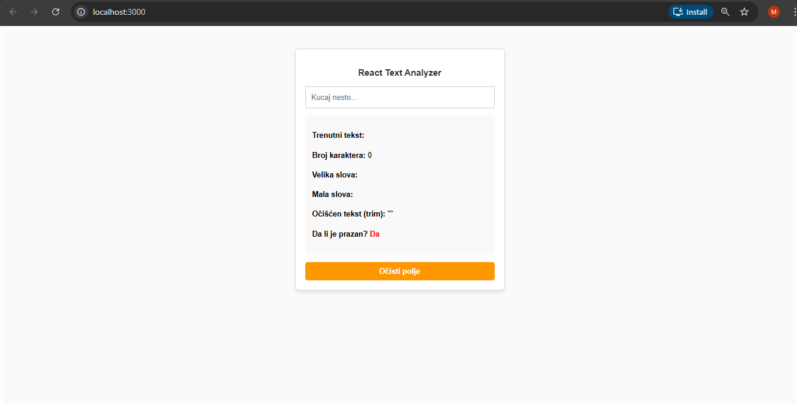
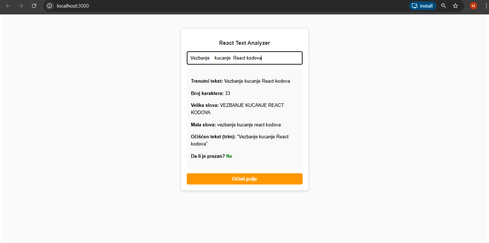

React Text Analyzer 📝

A clean, interactive text manipulation tool built with **React**. This application demonstrates real-time state management and string transformation techniques.

🚀 Features

* **Real-time Analysis**: See character count and transformations update instantly as you type.
* **Case Transformation**: Convert text to Uppercase and Lowercase on the fly.
* **Smart Trim**: Preview text with whitespace removed from both ends.
* **Validation**: Visual "Empty Field" indicator (Red/Green) using conditional logic.
* **Quick Reset**: One-click button to clear all input and reset the state.

📸 Preview

Initial State

*How the app looks when it's first loaded.*

Text Analysis in Action

*Example of the app analyzing a custom string.*

🛠️ Tech Stack

* **Framework**: React.js
* **State Management**: React Hooks (`useState`)
* **Styling**: CSS-in-JS (Inline Styles)

⚙️ How to Run

  1. Clone the repository.
  2. Run `npm install` to install dependencies.
  3. Start the application with `npm start`.